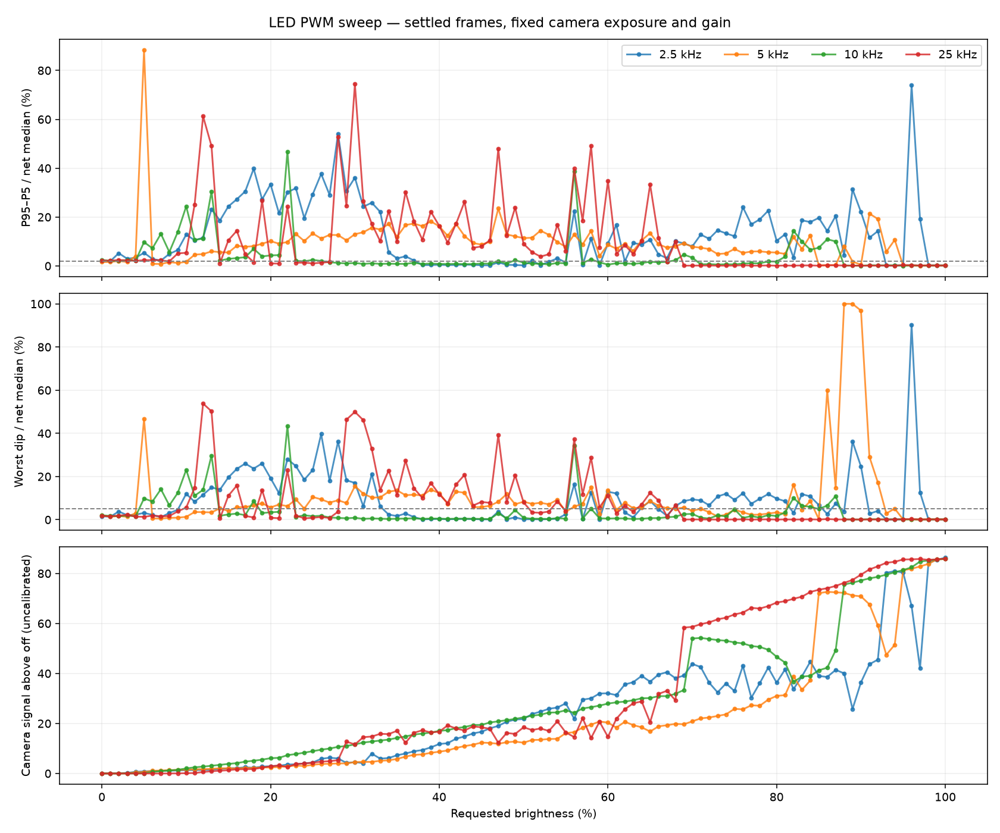
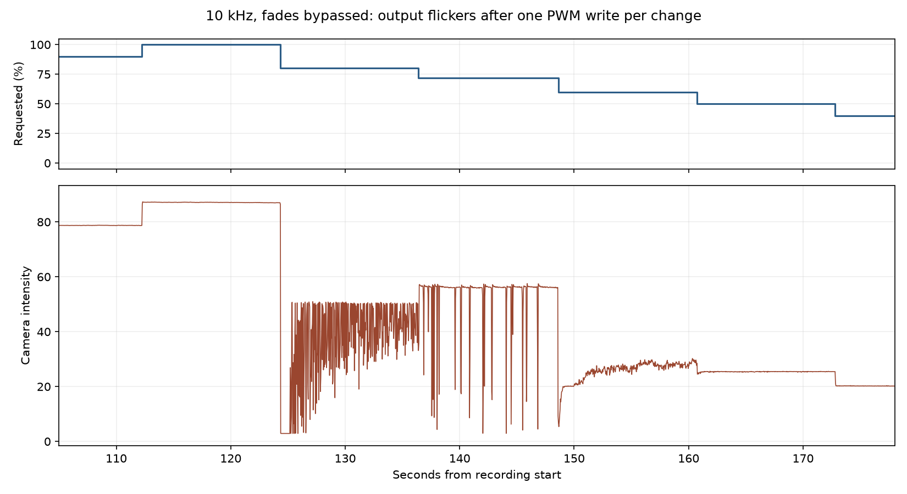
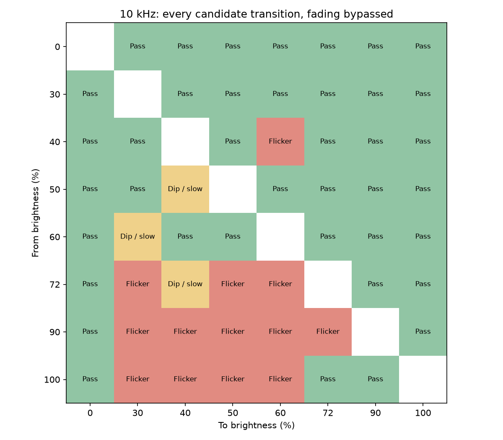

# LED PWM frequency and preset search — September 17, 2026

> Historical: the PWM controls and diagnostic APIs described here were removed
> on September 19, 2026. See [current on/off light control](LIGHT_CONTROL.md).

## Result

**10 kHz was the best of the four frequencies in the short brightness sweep,
but neither it nor the tested preset combinations provided reliable dimming.**
Some levels that passed a short hold flickered on longer holds or when approached
from a different brightness. Bypassing fading did not fix this. No preset UI was
installed, and no claim of five reliable settings is supported by these tests.

The existing converter/output power path remains the leading suspect, given the
previously measured output sag and this dependence on PWM load changes. These
tests do not identify the converter's exact failure mechanism or exclude analog
gate-drive problems. Replacing or substituting the 12 V source is the next useful
isolation test. See [previous electrical measurements](LED_MOSFET_LOSSES.md).

## Exhaustive whole-percent screen

Tested every integer request from 0 through 100 at **2.5, 5, 10, and 25 kHz**:
404 frequency/brightness combinations. Each frequency used the same shuffled
order (seed 17), four seconds per setting, with normal one-second fades. Off/full
references bracketed each frequency. Settled statistics exclude the first 1.5 s.

| PWM frequency | Settings passing the short optical screen, out of 101 |
| --- | ---: |
| 2.5 kHz | 26 |
| 5 kHz | 13 |
| 10 kHz | 63 |
| 25 kHz | 43 |

These are screening results, **not validated operating presets**. They include
off and full on. Screen criteria for illuminated levels: camera signal above the
off reference greater than 0.5 count, P95–P5 below 2% of that net signal, and each
extreme within 5% of the net median. Off uses a separate absolute noise criterion:
range and deviation from its reference below 0.2 count. Low readings below the
signal floor are not evidence of stable useful illumination. Camera values are
uncalibrated and nonlinear; the percentages describe camera-signal variation,
not calibrated luminous modulation or a flicker standard.

The output-versus-request curve is also nonmonotonic in several regions. At
10 kHz, for example, increasing the request through parts of 71–80% reduced the
measured light output. Selecting evenly spaced duty values would not guarantee
evenly increasing light levels.

## Longer holds and transitions at 10 kHz

Seventeen 12-second tests revisited 24, 30, 40, 50, 60, 72, 80, 90, and 100%,
including descending requests, with manual fading bypassed. Each command made
one PWM write. Eleven intervals passed the settled screen; six failed. Both
24% visits and both 80% visits failed. A descending visit to 72% included
blackouts; a descending visit to 60% had persistent fluctuations despite both
levels having passed when approached from below.

Next, every directed transition between **0, 30, 40, 50, 60, 72, 90, and 100%**
was tested once, still with fading bypassed: 56 distinct pairs, using a shuffled
Eulerian sequence and four-second holds. Of the 57 sequence intervals (including
the initial off point), 44 passed the settled screen. Only **40 of 56 pairs**
passed both the settled screen and the transition check. Transition checks
required settling within 0.2 s and limited excursions outside the endpoint
range to 3% of the relevant endpoint (with a 0.3-count noise floor). Sensor
latency is not calibrated, but observed bad transitions lasted much longer
than one camera frame.

No five-level subset of these candidates passed every internal transition.
The largest fully passing subsets had three states including off:
0/30/40, 0/30/50, 0/50/60, 0/72/100, and 0/90/100. These are single-pass results,
not long-term guarantees. This does not prove that no other narrow set of duty
values could work; it rules out presenting the tested useful-range candidates
as reliable presets.

A further diagnostic experiment inserted a **5 ms off interval** before direct
changes. It did not resolve the failures, and introduced blackouts even on some
near-full transitions. This experiment was removed from the source and final
firmware. There is no production blanking behavior.

## Camera, microphone, and GPIO evidence

- Logitech C925e `/dev/video4`, 1280×720 MJPEG input at approximately 30 fps;
  640×360 recorded video with original-resolution ROI photometry. Fixed exposure
  requested 200 units (readback approximately 199, about 20 ms), gain 150, fixed
  white balance and focus. ROI: x=500–1100, y=120–480, excluding the saturated
  reflection. Full-on ROI intensity was roughly 86–89 counts versus about 2.9 off.
- Acquisition times and HTTP events share the host monotonic clock. One-frame
  camera buffering was requested. This detects the slow flashing under study;
  it cannot certify absence of fast modulation. Per-frame timestamps preserve
  capture gaps instead of assuming perfect 30 fps timing.
- Antlion USB microphone, mono 48 kHz/16-bit, capture gain unchanged at its
  existing setting. The recordings contain PWM-associated narrowband tones,
  including approximately 5 kHz during lower-frequency trials and 10 kHz at
  some 10 kHz settings. A roughly 6.25 kHz component appeared in a 25 kHz segment.
  Room noise changed substantially during later recordings, including off/full
  references, so broadband noise changes cannot all be attributed to the circuit.
  There is **no validated “silent” operating set**. This microphone setup cannot
  verify ultrasonic emissions at 25 kHz or calibrated sound-pressure levels.
- The final no-fade 100→40% test at 10 kHz reproduced large settled fluctuations
  (P95–P5 approximately 44% of net camera signal). PWM readback remained 102/256
  with no write errors. Thirty-five concurrent digital pad observations were
  collected. The best had about 199–200 rising edges per 20 ms, approximately
  100 us periods, and about 39.3% sampled high time. Every sample had scheduling
  gaps (best 20 us, worst 7.83 ms), so these observations support ongoing PWM but
  do not certify individual edges, analog gate voltage, or switching loss.

## Losses and selection

Measured earlier at full on: approximately 65 mV MOSFET drain/source drop, giving
roughly 0.13 W conduction loss at the inferred 2 A LED current. Actual switching
loss was **not measured**; neither the webcam nor microphone measures it, and
no component-temperature reading was supplied during this test.

For illustration only, the overlap model `0.5 × V × I × (tr + tf) × f`, assuming
12 V, 2 A and a combined transition duration of 3.2–5 us, gives:

| Frequency | Illustrative switching loss, excluding conduction |
| --- | ---: |
| 2.5 kHz | 0.096–0.15 W |
| 5 kHz | 0.192–0.30 W |
| 10 kHz | 0.384–0.60 W |
| 25 kHz | 0.96–1.50 W |

This is sensitivity to hypothetical edge durations, **not measured losses or
bounds**. LED current falls as MOSFET voltage rises, and very short duty pulses
can invalidate the simple overlap model. The IRLZ44N has no guaranteed on-resistance
at 3.3 V. See [the detailed loss discussion](LED_MOSFET_LOSSES.md). Because 25 kHz
also had worse optical results than 10 kHz, it offered no demonstrated advantage
that would justify its greater switching rate.

## Firmware and reproducibility

The diagnostic image has off-only frequency selection and an `immediate=1` form
option on the brightness endpoint. Production firmware exposes neither test
control. The diagnostic image boots with LEDs off. The initial implementation
used `ledc_set_freq`, which retained the reference clock selected at 1 kHz and
rejected 5 kHz at eight-bit resolution. It was corrected to `ledcSetup`, which
reselects the timer clock. All five supported diagnostic frequencies were then
verified at zero duty before continuing the sweep. The failed clock change
ended the first recording after the completed 2.5 kHz sweep; no 5 kHz data from
that failed attempt is counted.

Runner: [scripts/led_frequency_sweep.py](../scripts/led_frequency_sweep.py).
Examples and capture limits: [LED signal diagnostics](LED_SIGNAL_DIAGNOSTICS.md).

Raw artifacts under `/tmp/sisyphus-led-sweep/`:

- `grid/`: complete 2.5 kHz grid, followed by the rejected clock change.
- `grid-rest/`: complete 5, 10, and 25 kHz grids.
- `candidates-10k/`: 12-second no-fade candidate holds.
- `all-pairs-10k/`: all 56 candidate transitions.
- `blank-5ms/`: unsuccessful blanking experiment.
- `pad-confirmation/`: final 10 kHz no-fade camera/GPIO check.

Each capture contains video, raw microphone audio, frame CSV, command/result
JSONL, and metadata. Derived analysis, plots, transition data, and audio spectra
are alongside them. Temporary raw recordings are not checked into the repo.

Final validation: production and lights-only ESP32 builds passed; Arduino 2/3
host fade, signal, and diagnostic frequency/immediate-change tests passed with
ASan/UBSan; Python syntax and `git diff --check` passed. Final bench state is the
lights-only diagnostic image, **1 kHz and LEDs off**, with camera automatic
exposure, frame-rate adjustment, white balance, and focus restored. Motors/SD
remain disabled as before. No preset UI, production frequency increase, or
production fading change was made.

## Subsequent control change

After this search, the user requested a five-level slider and then broader
spacing. The current configuration is 10 kHz with Off plus 30/45/60/75/100%,
without fades. This later user-requested compromise supersedes the restored
1 kHz state described above; it does not overturn the failed stability findings.
See [current preset behavior and validation](LED_PRESETS.md).
