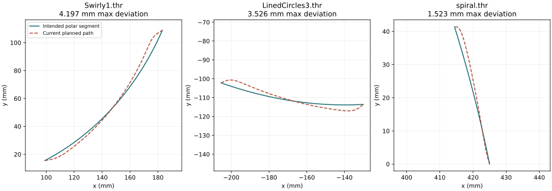

# THR motion accuracy assessment

Assessment baseline: `main` at `f39a7ea`, synchronized September 16–17, 2026.
Worktree: `SisyphusTable-motion-accuracy`, branch `assess/motion-accuracy`.

This is the historical baseline assessment. The fixes and their replay results
are recorded in [the implementation report](MOTION_ACCURACY_IMPLEMENTATION.md).

**Yes: there are substantial, measurable software improvements available.**
Matching each waypoint and reaching both axis targets at the same time does
not guarantee that the path between those waypoints matches the THR file.
This planner has that exact problem. It also truncates the angular conversion
factor, introducing cumulative angular error even with an ideal mechanism.

The assessment commit adds an offline audit, numerical checks, replay results,
and plots. That commit does not change or deploy motor firmware. Results below distinguish
commanded geometry from physical ball accuracy; no physical motion was measured
during this assessment.

## What THR asks the machine to draw

Between consecutive coordinates, THR specifies linear interpolation **in polar
coordinates**. Both coordinates must advance by the same fraction:

```
theta(u) = theta0 + u * (theta1 - theta0)
rho(u)   = rho0   + u * (rho1   - rho0),    0 <= u <= 1
```

The rate of `u` can change to accelerate and decelerate without changing the
curve. Different progress fractions for theta and rho change the curve.
Unwrapped theta values preserve complete revolutions and their direction.
Converting every segment into a straight Cartesian chord, wrapping every angle
to 2π, or selecting the shortest angular move would change the pattern.
This interpretation is confirmed in the [Sisyphus format discussion](https://sisyphus-industries.com/community/community-tracks/creating-new-tracks/).

## Replay evidence

The audit loads all **24 test patterns plus 2 examples: 158,112 coordinates,
158,025 nonduplicate segments**. It runs the actual `MotionPlanner.cpp` and
`SCurve.cpp` through the native timer and streaming ring buffer, then samples
each committed profile at 33 equally spaced times. It measures nearest
Cartesian distance to that segment's intended polar curve. The approach to
the first coordinate is excluded because it is not a segment in the file.

Configuration matches the checked-in production defaults: 425 mm radius,
theta 16 microsteps / 1909 integer steps per radian, rho 8 microsteps /
400 steps per mm, theta limits 0.225 rad/s, 2 rad/s², 10 rad/s³, rho limits
5.5 mm/s, 20 mm/s², 100 mm/s³. Both **5/10** and **10/10** (the default speed
setting) were replayed. Persisted settings on the device were not read.

| Pattern | Profile shape error, 5/10 | Profile shape error, 10/10 | Common progress + exact scale reference |
|---|---:|---:|---:|
| Example spiral | 0.747 mm | 1.523 mm | 0.039 mm |
| HexagonAlley | 1.963 mm | 2.971 mm | 0.079 mm |
| LinedCircles | 2.289 mm | 3.393 mm | 0.107 mm |
| LinedCircles3 | 1.690 mm | 3.526 mm | 0.094 mm |
| LinedCircles4 | 2.311 mm | 3.348 mm | 0.110 mm |
| Swirly1 | 1.868 mm | 4.197 mm | 0.107 mm |
| SquareErase | 2.056 mm | 3.390 mm | 0.111 mm |
| Example circle | ~0 mm | ~0 mm | 0.055 mm |

These are sampled maximum deviations, not average errors or certified upper
bounds. The first two error columns isolate the independent-profile problem
using the planner's quantized endpoints and its own coordinate scale. They
exclude gear-scale error, execution jitter, and mechanical error. The circle
correctly shows essentially zero profile shape error: rho is constant.

At 5/10, **123,167 segments (77.9%) exceed 0.25 mm** of profile shape error;
the worst sampled error is 2.311 mm. The geometric reference stays below
0.112 mm across the corpus. That reference uses one progress fraction, the
exact nominal gear ratio, double precision, and nearest absolute motor steps.
It is a geometric feasibility comparison, **not an implemented streaming
planner, a performance comparison, or a physical accuracy guarantee**.

A denser 129-sample check finds 1.524 mm for the example spiral and 3.564 mm
for LinedCircles3 at 10/10, versus 1.523 and 3.526 mm in the main sweep. This
confirms the finding while illustrating why sampled maxima are lower bounds.



Full results:

- [10/10 machine-readable results](motion-accuracy/results.json) and [CSV](motion-accuracy/summary.csv)
- [5/10 results](motion-accuracy/speed-5/results.json) and [CSV](motion-accuracy/speed-5/summary.csv)
- [Corpus plot](motion-accuracy/corpus-error.svg)
- [Denser sampling check](motion-accuracy/dense-check/results.json)
- [Numerical checks](motion-accuracy/numerical-checks.json)

## Findings and recommended changes

### 1. The angular conversion factor causes cumulative drift

`PolarControl.hpp:getStepsPerRadian()` casts this expression to `int`:

```
200 * 16 * (60 / 16) / (2*pi) = 1909.8593171027442 steps/radian
stored value                = 1909 steps/radian
```

The commanded angle is systematically about **0.045% short**. Under the nominal
gearing, this corresponds to **0.162° per revolution**, or approximately
**1.20 mm at the 425 mm rim per revolution** before endpoint rounding. A
single exact full-turn target also loses a fractional endpoint step through
truncation; the numerical reproduction gives a 1.335 mm closure error.

The error is proportional to the magnitude of the unwrapped angle. A constant
angular offset can rotate a pattern; this scale error changes as the pattern
progresses. Long files are particularly vulnerable. The nominal-mechanism
model predicts waypoint errors up to 188.6 mm for Spiral1, 301.8 mm for Spiral4,
457.6 mm for SquareErase, and 704.2 mm for david. These large values are
**predictions using the gearing in the source**, not observations of the ball.
They compare the corresponding source waypoints, not the nearest unrelated
line elsewhere in a self-crossing drawing. Symmetric circles can conceal
angular phase error visually.

**Recommendation:** preserve the fractional conversion throughout the API and
planner; preferably store exact steps per revolution and convert using double
precision outside the ISR. Round absolute target step counts to nearest.
Keep an integer step ledger. Add full-revolution closure tests and long-file
checks against the nominal physical ratio, not the same truncated constant
used by the planner. Apply calibration changes while idle with a consistent
logical origin.

This is the first change to implement: it is smaller than a planner rewrite
and eliminates a systematic error that tuning cannot fix.

### 2. Independent S-curves distort the intended polar segment

`MotionPlanner.cpp:calculateSegmentProfile()` calculates independent axis
S-curves and solves for a common duration. `fillStepQueue()` subsequently
calculates separate `thetaFrac` and `rhoFrac`. Arrival synchronization and
boundary velocity reconciliation do not constrain those fractions to agree.
The measured millimeter-scale deviations follow directly from this design.

**Recommendation:** plan one scalar progress trajectory for both axes. For
a linear polar segment, derive scalar limits from the moving axes:

```
u_velocity <= min(theta_velocity_limit / abs(delta_theta),
                  rho_velocity_limit / abs(delta_rho))
```

Apply the same projection for acceleration and jerk, omitting stationary
axes. Generate both absolute axis positions from the same `u`. The audit's
self-test constructs a feasible shared S-curve for a mixed move, checks the
axis velocity/acceleration limits, and independently checks its geometry.

The junction design matters. At a true change in the polar direction vector,
an exact piecewise-linear polar path cannot maintain nonzero, continuous
velocity through the corner. Stopping at every dense waypoint would be slow
and could leave marks in the sand. A production replacement should:

1. Carry speed across exactly compatible directions and merge redundant
   collinear points without changing the curve.
2. Stop at incompatible corners in a strict fidelity mode.
3. Offer explicitly bounded corner blending for smooth drawing, measured in
   Cartesian millimeters. Start with a proposed 0.05–0.10 mm **software
   geometry budget**, then test throughput and physical results. This is not
   an established table accuracy specification.
4. Keep lookahead, step generation, and committed profiles consistent when
   filling the ring buffer or changing speed.

Simply forcing `rhoFrac = thetaFrac` inside the existing generator is not a
complete fix: it can violate rho limits and the existing boundary velocities.
Subdividing files into more points may reduce distortion, but does not solve
the interpolation rule and can increase planner load and junction stops.

### 3. Float precision needs attention at both large angles and long durations

`parseLine()` reads theta with `strtof`; `PolarCord_t` and segment targets
store floats. `thetaToSteps()` also multiplies in float before truncation.
`david.thr` reaches 23,237.463 radians: the float spacing there is
0.001953125 rad, about **0.83 mm at the rim**. At its roughly 44 million theta
steps, float multiplication can also resolve only multiples of four steps.
Changing only the return type of `getStepsPerRadian()` is therefore incomplete.

Separately, `fillStepQueue()` repeatedly executes `t += 0.00005f` in firmware.
At **1024 seconds**, float spacing becomes larger than twice that increment,
so the addition returns exactly the same value. The generator can repeatedly
exhaust its processing time budget without advancing. It does not escape by
waiting for the hardware clock because the stuck value is segment-relative.

This is reachable in the existing corpus: Spiral8 lines 1922–1923 request
37.94634445 rad while rho rises from 0.79056942 to 1. At speed 1/10, theta
alone requires at least **1686.5 seconds**, before acceleration overhead.
The native timer uses 250 μs, so its corresponding float boundary is different.

**Recommendation:** use an integer sample index or integer microsecond offset
for generation and derive evaluation time from it. Preserve sufficient
precision through parsing, target conversion, and long-angle telemetry; use
double precision or an explicit integer-turn/local-angle representation.
Do not discard complete turns. Add firmware-period tests that start near the
precision boundary, plus timestamp wrap tests; do not spend minutes simulating
empty ticks just to reach the boundary.

### 4. Pause and speed changes can add paths not present in the file

`capturePendingTargetsForResume()` preserves pending waypoints, which is useful.
However, `stopGracefully()` terminates the generated segment and computes
independent stopping distances, adding cruise to synchronize braking. The
braking endpoint is not constrained to the original THR segment. Resume then
connects that new position to the saved target. The speed-change path also
uses this stop/replay mechanism.

**Recommendation:** decelerate along the planned geometric path, preserving
the active source segment and scalar progress for resume. Look ahead far
enough to brake across subsequent source segments if necessary. Add geometric
pause/resume and live speed-change regressions; preserving the destination
list alone is insufficient. This finding is based on the code path; the
corpus metrics above cover uninterrupted playback only.

### 5. Axis limits do not directly limit ball speed or acceleration

At the full theta limit, tangential speed at 425 mm is **95.6 mm/s**, compared
with the 5.5 mm/s radial limit. At default 5/10 those become 47.8 and
2.75 mm/s. The same angular setting produces much slower ball movement near
the center. Limits expressed only per axis do not constrain all planar
acceleration terms, including centripetal acceleration and the effect of
simultaneously changing radius and angle.

**Recommendation:** retain motor limits and add a ball-speed limit in mm/s
and a curvature/planar-acceleration constraint to the path planner. Measure
which envelope keeps the ball following the magnet under the actual sand
load. Reducing speed helps profile distortion in the current planner, but
does not repair geometry, angle scale, backlash, or an incorrect origin.

### 6. Parsing, transitions, and test coverage leave accuracy gaps

- The active file task validates finite coordinates and normalized rho, but
  treats invalid lines like comments and skips them. A damaged coordinate can
  silently connect the preceding point to a later point and draw an unintended
  shortcut. Reject/report invalid data separately from valid comments, ideally
  before playback. The legacy `FilePosGen` is not the active SD playback path.
- File start coordinates are submitted as absolute positions from the current
  location. Approaches and playlist transitions can leave additional visible
  lines. Treat these explicitly and keep them out of THR fidelity metrics;
  choose whether pattern rotation relative to the previous track is desired.
- The current native corpus tests use **450 mm, 100 rho steps/mm, 3000 theta
  steps/rad, and different motion limits**, rather than production defaults.
  They verify completion, approximate final step counts, velocity continuity,
  and underruns. They do not compare the intermediate path with THR geometry.
- The audit's native executor still uses 250 μs callbacks and a deterministic
  10 ms feed cadence. Firmware uses 50 μs callbacks and a variable motor-loop
  cadence. Profile geometry findings transfer; timing and starvation coverage
  do not constitute an ESP32 execution guarantee.
- At production scaling, the 10/10 native replay also finds small rho ledger
  discrepancies, up to **13 steps / 0.0325 mm** in SquareErase. A focused
  reproduction confirms that `fillStepQueue()` can mark a segment complete
  after advancing the sample time to its duration, even when the horizon
  prevented that endpoint sample from being evaluated. The next segment then
  assumes the target was reached. Require final target steps to be queued
  before generation completes. This was reproduced with the **native 250 μs
  interval**; it is not evidence that the 50 μs firmware loses the same number
  of steps at these default speeds. Test both intervals and their supported
  rates. The raw 10/10 JSON records actual integer-ledger endpoint errors.
- STEP telemetry and the web trace report the commanded step ledger, not the
  ball's measured location. The same wrong angular scale is used to convert
  that ledger back to radians, so the UI can appear accurate while the nominal
  mechanism is not. A PNG preview is also not an independent geometric oracle.

## Accuracy budget and physical validation

At the nominal 16-microstep theta setting, one output step is 0.000523599 rad,
or about **0.2225 mm tangentially at 425 mm**. Nearest-step quantization has
an ideal half-step rim bound of about **0.1113 mm**. Rho's commanded increment
is 0.0025 mm. These are command resolutions; they do not establish mechanical
resolution or accuracy. The reference corpus result below 0.112 mm is
consistent with those limits.

The physical residual includes rho-zero error, travel calibration, pulley and
belt errors, backlash, compliance, motor load and missed steps, microstep
nonlinearity, and ball/magnet lag through sand. Higher microstepping alone
does not resolve these and would alter the operator-selected acoustic setup.

After correcting software scale and interpolation, measure:

1. Theta closure after 1, 10, and 100 turns, in both directions; separately
   measure reversals to distinguish scale error from backlash.
2. Rho position at several known radii, approaching each from both directions;
   repeat the origin procedure to separate scale and homing repeatability.
3. Constant-radius circles, radial spokes, and mixed spiral moves at several
   radii and speeds; compare physical ball positions to the original THR in a
   calibrated overhead view or equivalent independent measurement.
4. Sharp corners, pause/resume, speed changes, and long unwrapped patterns.
   Capture STEP/DIR electrically if timing or skipped steps remain suspect.

Use the results to choose a physical accuracy target. The camera is a
validation instrument here; a runtime feedback system is a separate design
decision and is not necessary to fix the confirmed software defects.

## Implementation order

1. Correct fractional angular scale, absolute step rounding, and large-angle
   precision, with nominal-mechanism closure tests.
2. Replace float time accumulation, enforce endpoint generation before segment
   completion, and add production-period numerical tests.
3. Introduce shared path progress with explicit junction fidelity rules and
   source-path-preserving pause/speed transitions.
4. Add geometric corpus regressions, production-default execution coverage,
   and physical calibration/ball-following measurements.
5. Tune ball-speed and corner-blending limits from those measurements.

The first two changes can be small, reviewable firmware patches. The third
is a planner change and needs throughput, lookahead, braking, and acoustic
validation; the ideal reference plotted here should not be deployed as-is.

## Reproduce

From the assessment worktree:

```sh
bash scripts/run_all_tests.sh
pio run -e esp32dev
python scripts/audit_motion_accuracy.py --jobs 3
python scripts/audit_motion_accuracy.py --speed 0.5 --jobs 3 --output docs/motion-accuracy/speed-5
python scripts/audit_motion_accuracy.py --samples 128 --jobs 2 --output docs/motion-accuracy/dense-check example_patterns/spiral.thr test/test_motion/patterns/LinedCircles3.thr
```

The Python runner builds a temporary native executable with `g++`; it does not
contact the table. Plotting uses matplotlib when installed. JSON records the
baseline commit, file hashes, configuration, sampling, and per-pattern metrics.
The numerical self-test checks the path-distance evaluator against analytic
cases and an independent dense oracle, checks a shared-profile example, and
reproduces full-turn scale error, float-clock stagnation, and the native
horizon/endpoint-generation defect. Those defect reproductions intentionally
describe this baseline; update them to assert corrected behavior when fixing
the planner.

Validation completed: the existing synthetic native suite and all 24 existing
pattern tests passed; `pio run -e esp32dev` passed. Both 26-file audit sweeps
completed without native queue underruns. The geometry reference self-test and
129-sample spot checks passed. No device was flashed or moved.
